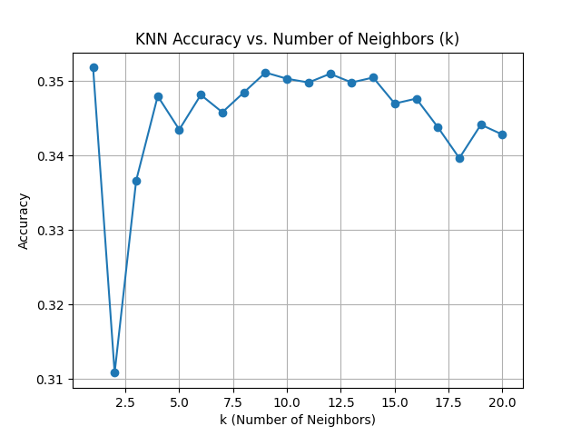
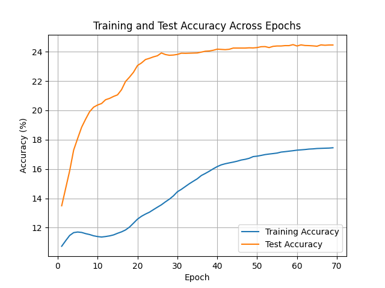

# Image Classification

Clonez le dépôt pour accéder au projet :

```bash
git clone https://gitlab.ec-lyon.fr/fsabri/image-classification.git
cd image-classification
```
# K-nearest Neighbors (KNN)
## Résultats de K-nearest Neighbors (KNN)

### Variation de la Précision en Fonction de $k$

Pour évaluer les performances de l'algorithme KNN, nous avons mesuré la précision en fonction du nombre de voisins ($k$). Nous avons fait varier $k$ de 1 à 20 et avons observé la précision obtenue sur l'ensemble de test.



**Observations** :
  - La précision commence autour de 0.35 pour $k = 1$, diminue rapidement pour $k = 2$, puis augmente de manière stable pour atteindre un maximum pour un $k = 9$.
  - La précision décroît légèrement après ce point optimal, ce qui montre que l'augmentation de $k$ au-delà de 9 ne conduit pas à une amélioration de la précision.
  - La meilleure précision obtenue est d'environ **0.35** pour $k = 9$.
### Précision Finale de KNN

- **Meilleure Précision** : 0.3512
- **Meilleure Valeur de $k$** : 9 

Ces résultats montrent que le choix de $k$ impacte significativement la performance de KNN, et qu'il est crucial de trouver un $k$ adapté aux données.


# Multilayer Perceptron (MLP) Classifier with Backpropagation
## Introduction
Ce projet a pour objectif de développer un classificateur basé sur un réseau de neurones multicouche (MLP) en utilisant l'algorithme de rétropropagation du gradient (backpropagation).

## Structure du Réseau de Neurones
Le MLP utilisé ici comprend une couche cachée et une couche de sortie. La fonction d'activation choisie pour chaque couche est la fonction sigmoïde.

$W^{(L)}$ : La matrice des poids pour la couche $L$.
$B^{(L)}$ : Le vecteur des biais pour la couche $L$.
$Z^{(L)}$ : Le vecteur des valeurs avant activation pour la couche $L$.
$A^{(L)}$ : Le vecteur des valeurs après activation pour la couche $L$.
Fonctions de Coût et Activation
Fonction d'activation : Sigmoïde, définie comme $\sigma(x) = \frac{1}{1 + e^{-x}}$.
Fonction de coût : Erreur quadratique moyenne (MSE), définie comme $C = \frac{1}{N_{out}} \sum_{i=1}^{N_{out}} (\hat{y}_i - y_i)^2$.
## Dérivées pour la Rétropropagation
1. Gradient par rapport à $A^{(2)}$ (sortie du réseau)
Le gradient de la fonction de coût $C$ par rapport à $A^{(2)}$, la sortie du réseau, est : $\frac{\partial C}{\partial A^{(2)}} = \frac{2}{N_{out}} (A^{(2)} - Y)$

2. Gradient par rapport à $Z^{(2)}$ (après la dernière couche cachée)
Utilisant la règle de la chaîne, on obtient : $\frac{\partial C}{\partial Z^{(2)}} = \frac{\partial C}{\partial A^{(2)}} \cdot (A^{(2)} \times (1 - A^{(2)}))$ où $A^{(2)} \times (1 - A^{(2)})$ est la dérivée de la fonction sigmoïde.

3. Gradient par rapport à $W^{(2)}$ (poids de la dernière couche)
Le gradient par rapport aux poids de la dernière couche est donné par : $\frac{\partial C}{\partial W^{(2)}} = \frac{\partial C}{\partial Z^{(2)}} \cdot (A^{(1)})^T$

4. Gradient par rapport à $B^{(2)}$ (biais de la dernière couche)
Le gradient par rapport aux biais de la dernière couche est simplement : $\frac{\partial C}{\partial B^{(2)}} = \frac{\partial C}{\partial Z^{(2)}}$

5. Gradient par rapport à $A^{(1)}$ (sortie de la première couche cachée)
Le gradient par rapport à $A^{(1)}$ peut être exprimé en utilisant $W^{(2)}$ : $\frac{\partial C}{\partial A^{(1)}} = \frac{\partial C}{\partial Z^{(2)}} \cdot W^{(2)}$

6. Gradient par rapport à $ Z^{(1)} $ (après la couche d’entrée)
Le gradient de $C$ par rapport à $Z^{(1)}$ est donné par : $\frac{\partial C}{\partial Z^{(1)}} = \frac{\partial C}{\partial A^{(1)}} \cdot (A^{(1)} \times (1 - A^{(1)}))$

7. Gradient par rapport à $W^{(1)}$ (poids de la première couche)
Le gradient par rapport aux poids de la première couche est : $\frac{\partial C}{\partial W^{(1)}} = \frac{\partial C}{\partial Z^{(1)}} \cdot (A^{(0)})^T$

8. Gradient par rapport à $B^{(1)}$ (biais de la première couche)
Enfin, le gradient par rapport aux biais de la première couche est : $\frac{\partial C}{\partial B^{(1)}} = \frac{\partial C}{\partial Z^{(1)}}$


### Précision en Fonction des Époques

Pour le classificateur MLP, nous avons mesuré l’évolution de la précision d’entraînement en fonction du nombre d’époques (epochs). Ce graphique montre les variations de précision à chaque époque.




### Observations

- La précision de test atteint environ **24 %** tandis que la précision d'entraînement atteint environ **18 %**. Cela suggère que le modèle a atteint un plateau avec cette configuration simple.
- La réduction progressive du taux d'apprentissage a permis de **stabiliser l'entraînement** .
- L'arrêt de l'entraînement après 70 époques a été bénéfique pour maintenir la stabilité et éviter le surapprentissage.

### Conclusions

Pour des tâches de classification d'images complexes comme CIFAR-10, un modèle MLP atteint ses limites rapidement. L'utilisation de réseaux convolutifs (CNN) est recommandée pour améliorer les performances. Néanmoins, ce projet montre comment une stratégie de réduction progressive du taux d'apprentissage peut aider à stabiliser et à optimiser l'entraînement d'un modèle de base.
